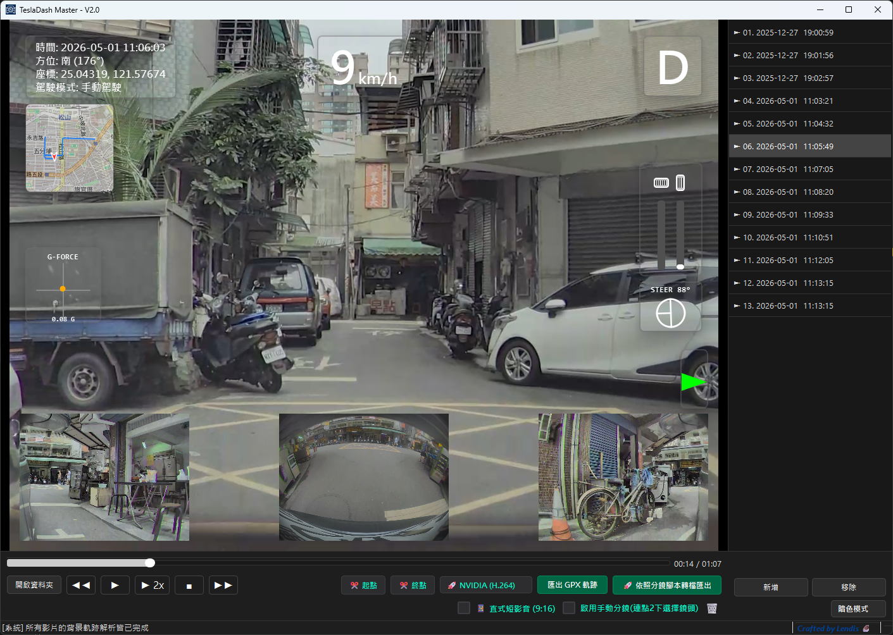
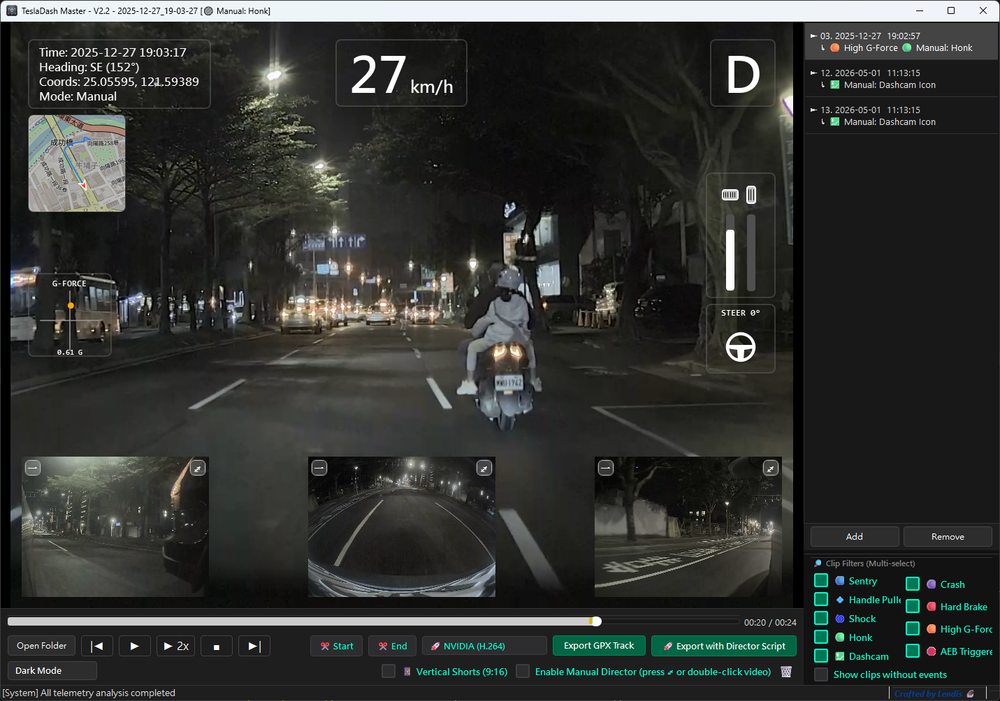
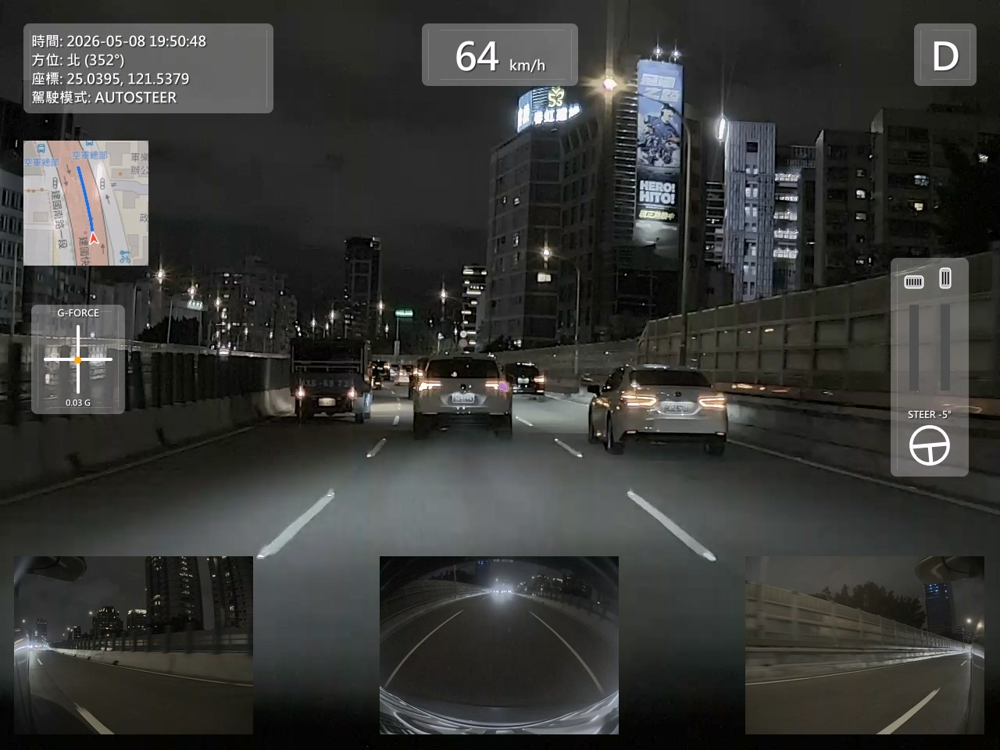
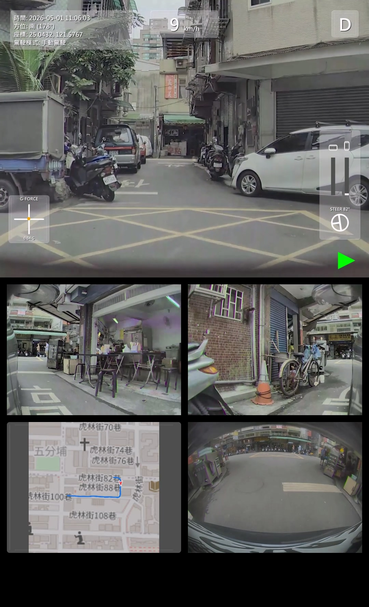

TeslaDash Master V2.3 - Readme
==================================================

Developed by Lendis | 2026

1. INTRODUCTION
TeslaDash Master is a powerful post-processing tool for Tesla Dashcam and Sentry Mode clips. It overlays real-time vehicle telemetry (Speed, G-Force, Pedals, Steering, GPS Map) onto your videos.

2. KEY FEATURES
- Professional HUD Dashboard Overlay.
- Supports Horizontal (4:3) and Vertical (9:16) formats.
- Smart Auto-adaptation for HW3 and HW4 (6-camera support).
- Director Mode for manual camera switching.
- GPX Track Export for Google My Maps.
- SHA-256 Signature protection for telemetry data.
- Video zoom function (New in V2.1)
- Playlist filtering function: Quickly find event videos (New in V2.2)
- Map Gallery (New in V2.3)

3. SYSTEM REQUIREMENTS
- OS: Windows 10 / 11 (64-bit Only) or macOS 11.0+ (Big Sur or later).
- CPU: Intel i5 / Ryzen 5 / Apple Silicon (M1/M2/M3) or higher.
- GPU: Hardware acceleration (NVIDIA / AMD / Intel / Apple Metal) highly recommended.
- Note (macOS Only): To use the video export/conversion features, FFmpeg must be installed on your system (Recommended via Homebrew: brew install ffmpeg).

4. QUICK START
- Launch the application and click "Open Folder".
- Select a TeslaCam folder containing *-front.mp4 clips.
- Set Start and End markers on the timeline.
- Select your preferred encoder and click "Export".

5. SUPPORT & DONATION
If you find this tool useful, please consider supporting the developer:
- Buy Me a Coffee: https://ko-fi.com/lendis
- LINE Pay : lendis28

==================================================

TeslaDash Master V2.3 - 讀我檔案
==================================================

開發者：Lendis | 2026

1. 簡介
TeslaDash Master 是一款強大的特斯拉行車紀錄器與哨兵模式片段後製工具。它能將即時車輛遙測數據（時速、G力、踏板、轉向、GPS 地圖）疊加到您的影片中。

2. 核心功能
- 專業 HUD 儀表板疊加。
- 支援橫式 (4:3) 與直式 (9:16) 格式。
- 智慧自動適配 HW3 與 HW4（支援 6 鏡頭）。
- 導演模式可手動切換鏡頭。
- 可匯出 GPX 軌跡供 Google 我的地圖使用。
- 遙測數據具備 SHA-256 簽章保護。
- 子螢幕縮放功能。 (V2.1 新增)
- 播放清單篩選功能:快速找出事件影片 (V2.2 新增)
- 地圖總覽 (V2.3 新增)

3. 系統需求
- 作業系統： Windows 10 / 11 (僅限 64 位元) 或 macOS 11.0+ (Big Sur 或更新版本)。
- 處理器： Intel i5 / Ryzen 5 / Apple Silicon (M1/M2/M3) 或更高。
- 顯示卡： 強烈建議具備硬體加速（NVIDIA / AMD / Intel / Apple Metal）。
- 注意 (僅限 Mac 使用者)： 若需使用影片轉檔與匯出功能，系統必須先安裝 FFmpeg（建議透過終端機使用 Homebrew 安裝：brew install ffmpeg）。

4. 快速上手
- 啟動程式並點擊「開啟資料夾」。
- 選擇包含 *-front.mp4 片段的 TeslaCam 資料夾。
- 在時間軸上設定起點與終點標記。
- 選擇您偏好的編碼器並點擊「匯出」。

5. 支持與贊助
如果您覺得這個工具有幫助，請考慮支持開發者：
- Buy Me a Coffee: https://ko-fi.com/lendis
- LINE Pay : lendis28

==================================================

## 🌟 實際效果 (Screenshots)

### 軟體主介面 (User Interface)

### 轉檔匯出 - 橫式傳統排版 (Export - Horizontal Layout 4:3)
*HUD 儀表板與地圖軌跡疊加，適合 YouTube 與事故分析。*

### 轉檔匯出 - 直式短影音排版 (Export - Vertical Shorts 9:16)
*專為手機觀看優化，適合 IG Reels、TikTok 與 YouTube Shorts。*

> ---
## 📥📥 Download & Installation (下載與安裝)
👉 Download Latest Version (最點此下載新版) https://github.com/lendis-personal/TeslaDash_Master/releases/

> ⚠️ **Installation & Security Notice (安裝與安全小提醒)**：

This software is a free tool built by an independent developer. Because it does not have an enterprise Microsoft Code Signing Certificate, Windows might display a blue "Windows protected your PC" SmartScreen warning when you first run the installer.

How to install: Simply click "More info" ➡️ then click "Run anyway" to proceed safely.

Bypassing Apple Security: Since this app isn't signed with a paid Apple Developer certificate, macOS might show a "damaged" or "unidentified developer" warning. To bypass this on your first launch, hold down the Control key, click the .app file, and select "Open".

🛡️ Security Guarantee: This installer has been scanned by VirusTotal using 60+ mainstream antivirus engines. (Note: Due to the Nuitka executable packing process, 1 or 2 engines might show a low-confidence Machine Learning false positive. All major engines like Microsoft Defender report it as 100% clean).

📄 View the full scan report: [VirusTotal Report](https://www.virustotal.com/gui/file/046bcc55f9b5a53138321c23b3b5570ad18e1b9a9621463a7d51c95a3a71fb37?nocache=1)
> ---
本軟體為獨立開發者利用業餘時間打造的免費工具。由於未購買微軟企業數位簽章，首次安裝時 Windows 可能會彈出「Windows 保護您的電腦」藍色提示畫面。

安裝方式：請點擊 「其他資訊」 ➡️ 點選 「仍要執行」 即可順利安裝。

**mac安全阻擋**：因為軟體沒有付費給蘋果認證，第一次開啟 `.app` 時，**必須按住鍵盤的 `Control` 鍵，再對著 App 點擊右鍵選擇「打開」**，才能繞過蘋果的「已損壞」警告。

🛡️ 安全保證：本安裝檔已經過 VirusTotal 全球 60+ 款主流防毒軟體檢測確認安全！(註：因採用 Nuitka 封裝技術，極少數防毒引擎可能會產生機器學習的啟發式誤判，微軟等多數大廠皆檢測為安全)。

📄 查看完整掃毒報告：[VirusTotal 檢測報告](https://www.virustotal.com/gui/file/046bcc55f9b5a53138321c23b3b5570ad18e1b9a9621463a7d51c95a3a71fb37?nocache=1)
