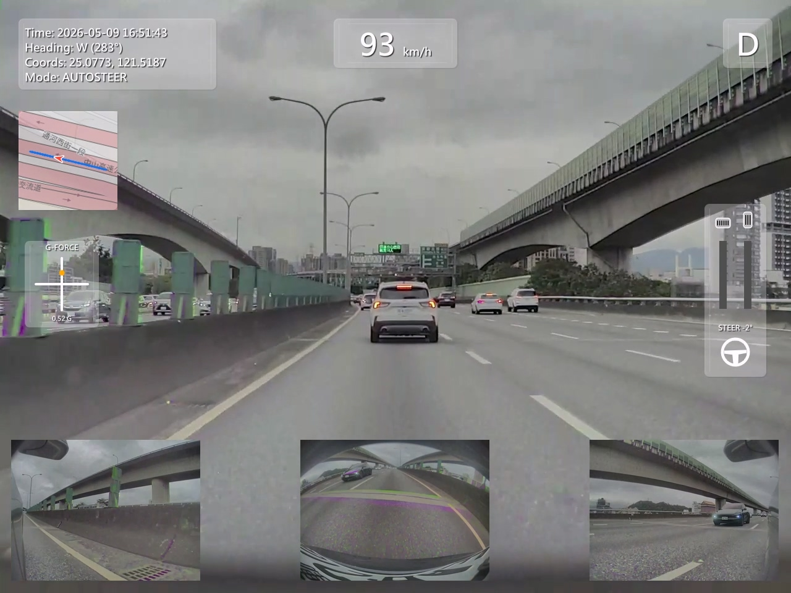
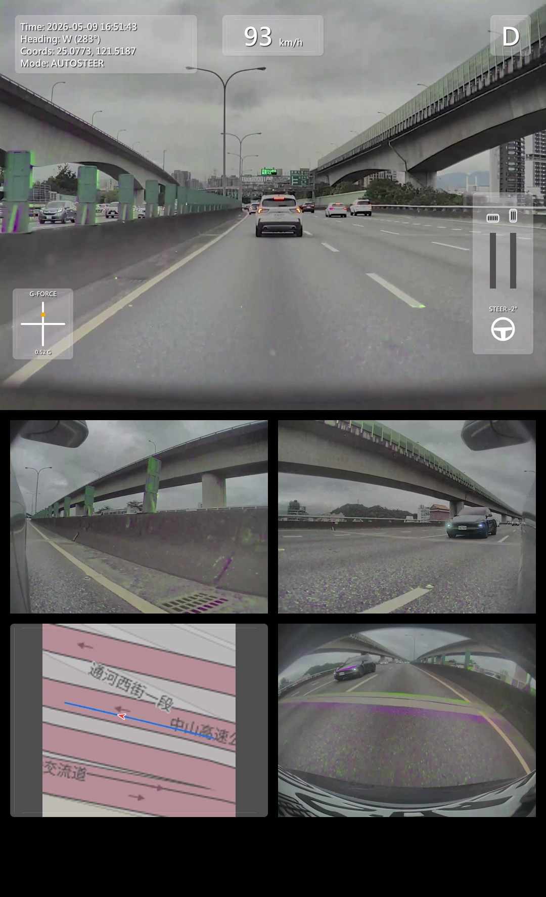

TeslaDash Master V2.0 - Readme
==================================================

Developed by Lendis | 2026

1. INTRODUCTION
TeslaDash Master is a powerful post-processing tool for Tesla Dashcam and Sentry Mode clips. It overlays real-time vehicle telemetry (Speed, G-Force, Pedals, Steering, GPS Map) onto your videos.

2. KEY FEATURES
- Professional HUD Dashboard Overlay.
- Supports Horizontal (4:3) and Vertical (9:16) formats.
- Smart Auto-adaptation for HW3 and HW4 (6-camera support).
- Director Mode for manual camera switching.
- GPX Track Export for Google My Maps.
- SHA-256 Signature protection for telemetry data.

3. SYSTEM REQUIREMENTS
- OS: Windows 10 / 11 (64-bit Only).
- CPU: Intel i5 / Ryzen 5 or higher.
- GPU: Hardware acceleration (NVIDIA/AMD/Intel) highly recommended.
- Software: FFmpeg must be present in the 'bin' folder.

4. QUICK START
- Launch the application and click "Open Folder".
- Select a TeslaCam folder containing *-front.mp4 clips.
- Set Start and End markers on the timeline.
- Select your preferred encoder and click "Export".

5. SUPPORT & DONATION
If you find this tool useful, please consider supporting the developer:
- Buy Me a Coffee: https://buymeacoffee.com/lendis
- LINE Pay / StreetPay: lendis28

6. FEEDBACK
For bug reports or feature requests, please contact the developer via GitHub or the original release platform.

==================================================

TeslaDash Master V2.0 - 讀我檔案
==================================================

開發者：Lendis | 2026

1. 簡介
TeslaDash Master 是一款強大的特斯拉行車紀錄器與哨兵模式片段後製工具。它能將即時車輛遙測數據（時速、G力、踏板、轉向、GPS 地圖）疊加到您的影片中。

2. 核心功能
- 專業 HUD 儀表板疊加。
- 支援橫式 (4:3) 與直式 (9:16) 格式。
- 智慧自動適配 HW3 與 HW4（支援 6 鏡頭）。
- 導演模式可手動切換鏡頭。
- 可匯出 GPX 軌跡供 Google 我的地圖使用。
- 遙測數據具備 SHA-256 簽章保護。

3. 系統需求
- 作業系統：Windows 10 / 11 (僅限 64 位元)。
- 處理器：Intel i5 / Ryzen 5 或更高。
- 顯示卡：強烈建議具備硬體加速（NVIDIA/AMD/Intel）。
- 軟體：'bin' 資料夾內必須存有 FFmpeg。

4. 快速上手
- 啟動程式並點擊「開啟資料夾」。
- 選擇包含 *-front.mp4 片段的 TeslaCam 資料夾。
- 在時間軸上設定起點與終點標記。
- 選擇您偏好的編碼器並點擊「匯出」。

5. 支持與贊助
如果您覺得這個工具有幫助，請考慮支持開發者：
- Buy Me a Coffee: https://buymeacoffee.com/lendis
- LINE Pay / 街口支付: lendis28

6. 反饋
如需回報 Bug 或功能建議，請透過 GitHub 或原始發布平台聯繫開發者。

==================================================
由 Lendis 傾情製作。

## 🌟 實際效果 (Screenshots)

### 軟體主介面 (User Interface)

### 轉檔輸出 - 橫式傳統排版 (Horizontal Layout 4:3)
*HUD 儀表板與地圖軌跡疊加，適合 YouTube 與事故分析。*

### 轉檔輸出 - 直式短影音排版 (Vertical Shorts 9:16)
*專為手機觀看優化，適合 IG Reels、TikTok 與 YouTube Shorts。*

